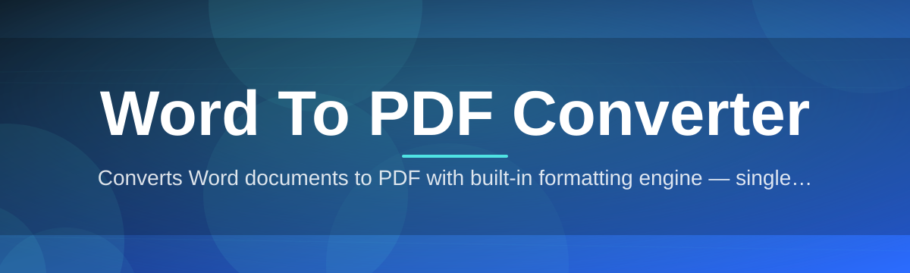
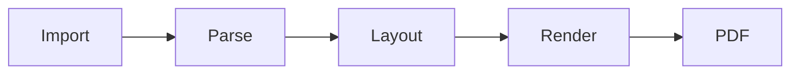

# word-to-pdf-tool 📄➡️📑

  

*Turn any Word document into a pixel-faithful PDF in the time it takes to blink.*

---

## 🧭 Overview

Every office, on some Tuesday afternoon, discovers the same small friction: a `.docx` file that needs to leave the building as a `.pdf`. Fonts drift, layouts wobble, and cloud converters ask you to upload sensitive contracts to a server you've never heard of. **word-to-pdf-tool** was built around a simple premise — document conversion should be instant, local, and boring in the best possible way. No accounts, no watermarks, no mystery servers holding your quarterly reports hostage.

This is a Windows-native **Word to PDF converter** engineered for people who convert documents constantly: paralegals finalizing filings, HR teams distributing offer letters, students submitting assignments, and small businesses turning proposals into shareable, tamper-resistant PDFs. Under the hood, it respects the structural integrity of your source file — headers, tables, embedded images, page breaks, and typography are preserved with a rendering pipeline tuned specifically for `.doc` and `.docx` formats.

Unlike browser-based converters that round-trip your files through someone else's infrastructure, everything here happens on your machine. That single architectural decision shapes almost every design choice in this project: the standalone binary, the offline-first workflow, and the deliberate absence of telemetry.

> [!NOTE]
> word-to-pdf-tool is purpose-built for Windows 10 and 11. There is no server component, no background service, and no data leaves your device during conversion.

### How it stacks up

| Capability | word-to-pdf-tool | Typical Web Converters | Bundled Office "Export" |
|---|---|---|---|
| Works offline | ✅ Always | ❌ Requires upload | ✅ Yes |
| Batch conversion | ✅ Native | ⚠️ Often paywalled | ❌ Manual, one at a time |
| Preserves complex layouts | ✅ High-fidelity engine | ⚠️ Inconsistent | ✅ Good |
| File size limits | ✅ None | ⚠️ Common (10–25MB) | ✅ None |
| Privacy (no upload) | ✅ Guaranteed | ❌ Not guaranteed | ✅ Yes |
| Setup time | ✅ Under a minute | ✅ None (but recurring) | ⚠️ Requires full Office suite |
| Standalone, no dependencies | ✅ Yes | N/A | ❌ Needs Office installed |
| Cost | ✅ One-time, transparent | ⚠️ Subscription-heavy | ⚠️ License required |

---

  

---

## 🛠️ What It Actually Does

**Precision Layout Rendering** — Tables don't collapse, columns don't drift, and page breaks land exactly where your original document intended. The rendering engine treats every element as a citizen with rights, not a suggestion.

**Batch Queue Processing** — Drop in a folder of fifty contracts and walk away. The converter processes them sequentially, logs each result, and never asks you to babysit a progress bar.

**Font & Style Fidelity** — Embedded fonts, custom styles, and formatting quirks from Word are mapped faithfully into the PDF output, so the document you send looks like the document you wrote.

**Drag-and-Drop Simplicity** — There is no menu-diving required. Drag a `.docx` or `.doc` file onto the window and the conversion starts — this is the whole interaction model.

**Offline-First Architecture** — Nothing is transmitted anywhere. The entire **Word to PDF converter** pipeline runs locally, which matters enormously for legal, medical, and financial documents.

**Metadata Preservation** — Document titles, author fields, and creation dates carry over into the resulting PDF instead of vanishing into a generic "Untitled" abyss.

**Custom Output Naming** — Choose destination folders and naming patterns so converted files don't quietly overwrite each other or scatter across your Downloads folder.

**Password-Aware Handling** — Protected Word documents prompt for credentials rather than silently failing or producing a corrupted output file.

**Lightweight Footprint** — A single standalone executable. No runtime installs, no background services eating memory while you're not converting anything.

---

## 🚀 Getting Started

1. **Visit the landing page** using the button above — this is the only supported distribution channel.

2. **Download the installer** for your Windows version (10 or 11, 64-bit).

3. **Run the setup wizard.** It finishes in under a minute and creates a desktop shortcut.

4. **Open a Word file** — either drag it onto the app window or use the built-in file picker — and click *Convert*.

> [!TIP]
> You can select multiple files at once before hitting Convert. The queue processes them in the order they were added.

---

## 💻 System Requirements

| Component | Minimum |
|---|---|
| Operating System | Windows 10 (64-bit) or Windows 11 |
| RAM | 2 GB available |
| Disk Space | 150 MB free |
| Dependencies | None — fully standalone |
| Internet Connection | Not required after download |

  

> [!IMPORTANT]
> word-to-pdf-tool does not require Microsoft Word or any Office license to be installed. The parsing engine is fully self-contained.

---

## ⚙️ How It Works

The conversion pipeline is deliberately linear — no hidden queues, no cloud round-trips, no surprises. Here's the shape of a single conversion:

1. **Ingest** — the source `.docx`/`.doc` file is read and its internal XML structure is parsed.
2. **Normalize** — styles, fonts, tables, and images are mapped into an intermediate layout model.
3. **Render** — the layout model is painted onto virtual pages matching your original margins and orientation.
4. **Export** — pages are compiled into a single PDF with embedded fonts and preserved metadata.

> [!NOTE]
> Because everything runs in-process on your machine, large files (200+ pages) convert in seconds rather than minutes — there's no network latency in the equation.

---

## 🩺 Troubleshooting

<strong>My PDF's fonts look different from the original document.</strong>

 

This usually happens when the source document uses a font that isn't installed on your system. word-to-pdf-tool substitutes the closest available match — installing the original font locally resolves the mismatch.

<strong>Conversion failed with a "document locked" message.</strong>

 

The source file is password-protected. Enter the credentials when prompted, or remove the protection in Word first if you have edit rights.

<strong>Tables are splitting awkwardly across pages.</strong>

 

This generally reflects the original Word pagination settings rather than a conversion defect. Adjust "keep rows together" in your Word table properties, then reconvert.

<strong>Batch conversion stopped partway through a folder.</strong>

 

Check the conversion log panel — one corrupted or unsupported file in a batch queue can pause processing. Remove the flagged file and resume the queue.

<strong>The output PDF is much larger than expected.</strong>

 

High-resolution embedded images inflate PDF size. Use the "optimize images" toggle in settings to compress embedded media without visibly degrading quality.

> [!WARNING]
> Converting extremely large documents (500+ pages) with dozens of embedded high-res images may require more available RAM than the stated minimum. Close other memory-heavy applications first if you notice slowdowns.

---

## 🎨 UI / UX Details

The interface favors clarity over decoration — a single window, a drop zone, and a queue list.

- **Keyboard Shortcuts**
  - `Ctrl + O` — Open file picker
  - `Ctrl + Enter` — Start conversion
  - `Ctrl + Shift + C` — Clear queue
  - `Esc` — Cancel active conversion

- **Themes** — Light, Dark, and a System-Sync mode that follows your Windows theme setting automatically.

- **Settings Panel**
  - Default output folder
  - Naming pattern for converted files
  - Image compression toggle
  - Notification preferences on batch completion

> [!TIP]
> Pin the app to your taskbar and enable "watch folder" mode in settings — any `.docx` dropped into that folder converts automatically.

---

## 🤝 Contributing & Community

Bug reports, feature requests, and thoughtful discussion are genuinely welcome. Open an issue describing what you expected versus what happened, and include your Windows version where relevant.

> Community members who report reproducible rendering edge cases have historically shaped several of the fidelity improvements shipped in past releases — this project listens.

Before opening a pull request:

- Keep changes focused and well-described
- Reference any related issue number
- Be patient — this is a measured, deliberately-paced project, not a rush job

---

## 📜 License

Released under the [MIT License](LICENSE), 2026. Use it, adapt it, ship it inside your own workflows — just carry the license notice along.

---

## ⚠️ Disclaimer

word-to-pdf-tool is provided "as is," without warranty of any kind. While the conversion engine is built for high layout fidelity, always review converted PDFs before distributing them for legal, financial, or contractual purposes. The maintainers are not liable for formatting discrepancies, data loss, or downstream consequences arising from use of this software.

  

